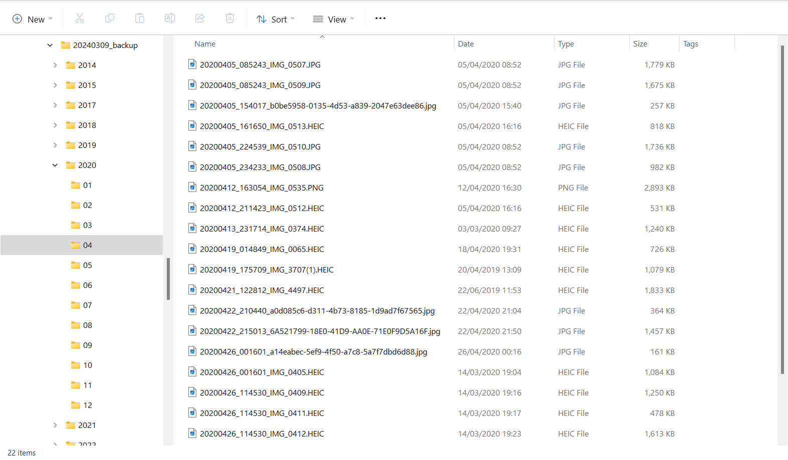

# iPhone Photo Organization

I recently faced a low disk space available on my iCloud drive, and the bulk of the allotted 50 gb was for photos.  I had to deal with it.

Photos stored in iCloud are often taken by more than one Apple client device, and as the years go by you may find it impossible to see these photos displayed in chronological order in a file explorer view.

After syncing to my local Windows machine 9,515 photos taken over the course of 10 years, and then copying them to another folder not controlled by iCloud, I wanted to do a spot check to see that I had all of my photos.

I was not keen on sorting them in Windows File Explorer as this process did not complete in a few minutes and I was uncertain how long it would take.  There is another issue with sorting by file timestamps because there are 2 to choose from: creation or modification.  When a file is copied from one machine to another the creation timestamp can be changed to indicate the date and time of copy, whereas the modification timestamp will retain the value it had on the original machine, which is often the same as the original creation timestamp. See [this sleuthkit discussion.](https://sleuthkit.discourse.group/t/created-time-is-newer-than-modified-and-access-time/3608)

> Note that with HEIC files there is another timestamp to examine, the date-taken timestamp, which is actually the best to use.  This requires a built version of the libheif.dll from C++ code and then installation of pyheif to access this DLL.  I do not have the time to go down this route right now.

So I asked ChatGPT with the following prompt to create a python script to reorganize my photos:

> Please write me a python script that reads the file info for all files in a directory, compares the file creation timestamp to the file modification timestamp and uses the earliest to rename the file as "YYYYMMDD_hhmmss_${existing_filename}" and moves it into a month sub-folder in a folder structure like so top_folder-year_folder-month_folder.

I only changed the name of the directory_path, ran the python script in Powershell and voilà in less than 2 minutes all photos were reorganized like I requested and I was able to easily do spot checks on the photos from a given year/month to give myself confidence that I had all my photos.

> Note in the screenshot that many HEIC files have an earlier timestamp which is the date-taken timestamp I talked about above.

I then deleted all photos from my iCloud drive and now I can begin again to take more photos than I will ever look at.
